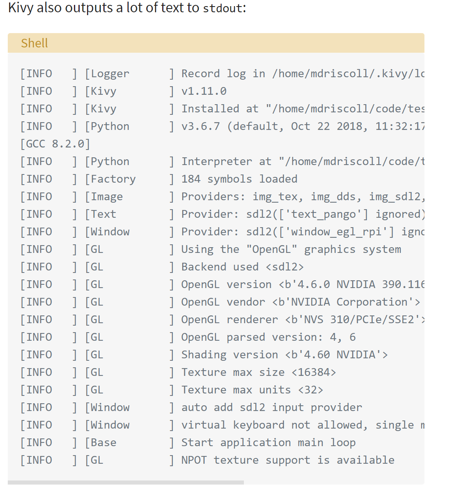

# This File focuses on mobile app development with Kivy
- [Kivy Real Python](https://realpython.com/mobile-app-kivy-python/)
- Benefits with Kivy is that not only will your application look the same on all platforms
- You do not need to compile your code after every change
- Most importantly you will be able to use pythons clear syntax to build your applications

# TOC
- Work with Kivy Widgets
- Lay out the UI
- Add events
- Use the K language
- Create a Calculator application
- Package your application for IOS, Windows, Android, and macOS

## Understanding the Kivy Framework
- `Kivy` supports  multi-touch events in addition to regular keyboard and mouse inputs
- It also supports GPU acceleration of its graphics since they're built use OpenGL ES2
- When you create an application with `Kivy you're creating a Natural User Interface or NUI`
- This way user can easily learn to use your software with little to no instructions
- Kivy does not attempt to use native controls or widgets. All of its widgets are custom-drawn
- Meaning `Kivy applications will look the same across all the platforms`
- This means your apps look and feel will differ from user's native applications

## Working with Kivy Widgets
- A `widget` is an onscreen control that the user will interact with
- `Hello_kivy.py` every application needs to `subclass App and override build()`
- This is where you'll put your `UI code or make calls to other functions that define your UI code`
- In this case we created a `Label widget` and pass its `text, size_hint, pos_hint)
- The latter two are not required
- `size_hint` tells Kivy the proportions to use when creating the widget. It takes two numbers
- The first is the `x-size or width of the control`
- The second is the `y-size or height of the control`
- Both numbers can be anywhere between `0 to 1(default)`
- To make app Run we need to instantiate your MainApp class and then call `run()` on the screen
- Calling run some text show up
- 
- This is also good for debugging 
- CHeck the text for `Image` vs `Label` widget

### Kivy Image
- `Kivy_image.py`
- Kivy has a couple of different image-related widgets to choose from
-  `Image` to load local images from harddrive
- `AsyncImage` to load an image from URL.
- In this code you `source` is important

### Laying out the UI
- [Kivy Docs](https://kivy.org/doc/stable/api-kivy.uix.layout.html)
- Each GUI framework has its own method of arranging widgets
- For eg. `wxPython you use sizers`
- `Tkinter used geometry manager`
- `Kivy is Layouts` and common ones `BoxLayout, FloatLayout, GridLayout`
- When creating a layout there are a few arguments you should know
- `padding`: between layouts and its children
    1. `A four-argument list`: [padding_left, padding_top, padding_right, padding_bottom]
    2. `A two-argument list` [padding_horizontal, padding_vertical]
    3. `A single argument`: padding=10
    
### Adding Events 
- GUI for Key presses `event-based`
- The framework responds to `keypresses, mouse events and touch events`
- It also has a concept of a `Clock` that you can use to schedule function calls for some time in the future
- Kivy also has the concept of `Properties`, which works with `EventDispatcher`
- Properties help you do validation checking
- Also fire events whenever a widget changes its size or position
- Let's add `button event` to your button code from earlier
- We use `button.bind(on_press=self.func_name)`
- This `on_press` method implicitly takes in widget instance, which is the button object itself, Finally
a message will printout to stdout whenever the user presses your button
  
## Using the KV Language
- Kivy provides a design language `KV` that you can use with the `Kivy Applications`
- It separates `interface design from applications's logic`
- This follows the `separation of concerns` principle and is part of the `MVC` architectural pattern
- For example the `Button`
- `class ButtonApp(App):
    def build(self):
        return Button()
    def on_press_button(self):
        print('You pressed the button!')`
  
- Creates a `Button` without setting any of its attributes or binding to any events
- What is happening Kivy will automatically look for a file that has the same name as the class in lowercase without the `App`
- Part of the class name
- In this case the class name is `ButtonApp` so Kivy will look for a file named `button.kv`
- If the file exists and properly formatted, then Kivy will use it to load up the `UI`.
- Create this file and the following code
- `<Button>:
    text: 'Press me'
    size_hint: (.5, .5)
    pos_hint: {'center_x': .5, 'center_y': .5}
    on_press: app.on_press_button()`
  
- the `on_press: app.on_press_button` is needed
- Line 1 matches the `Button` call in your Python code.
- It tells Kivy to look into the instantiated object for a button definition
- Line 2 sets the button `text`
- Line 3 sets the width and height with `size_hint`
- Line 4 sets the button's position with `pos_hint`
- Lie 5 sets the on press event handler. 
- To tell Kivy where the event handler is, you use `app.on_press_button()`.
- Here, Kivy knows will look in the Application class for a method called `on_press_button()`
- You can set up all your widgets and layouts inside one or more KV language files
- This file also supports importing Python modules in KV, creating dynamic classes and much more.
- Full details, check out [Kivy's guild to the KV language](https://kivy.org/doc/stable/guide/lang.html)

## Creating a Kivy Application
- This Calculator will support:
- `Addition, Subtraction, Multiplication, Division`
- Using [KV language](https://blog.kivy.org/2019/06/widget-interactions-between-python-and-kv/)

